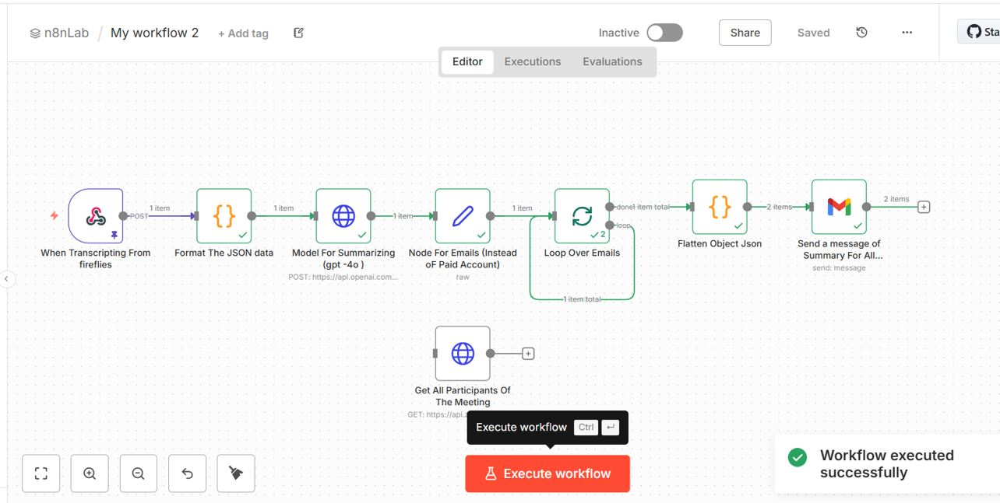
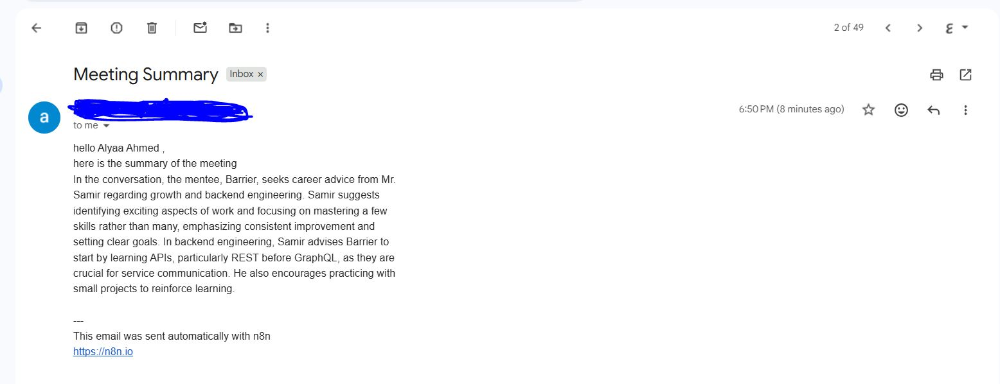
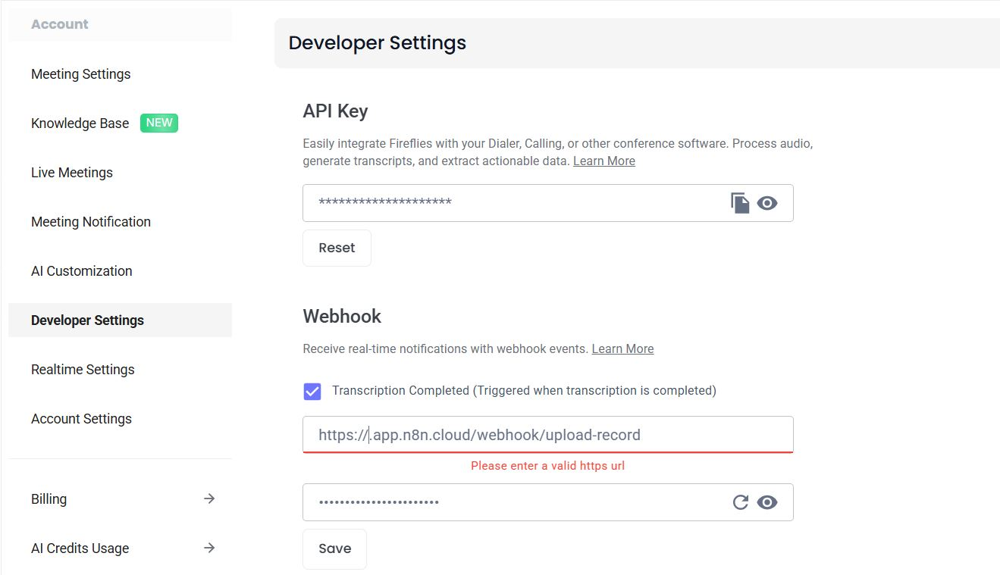
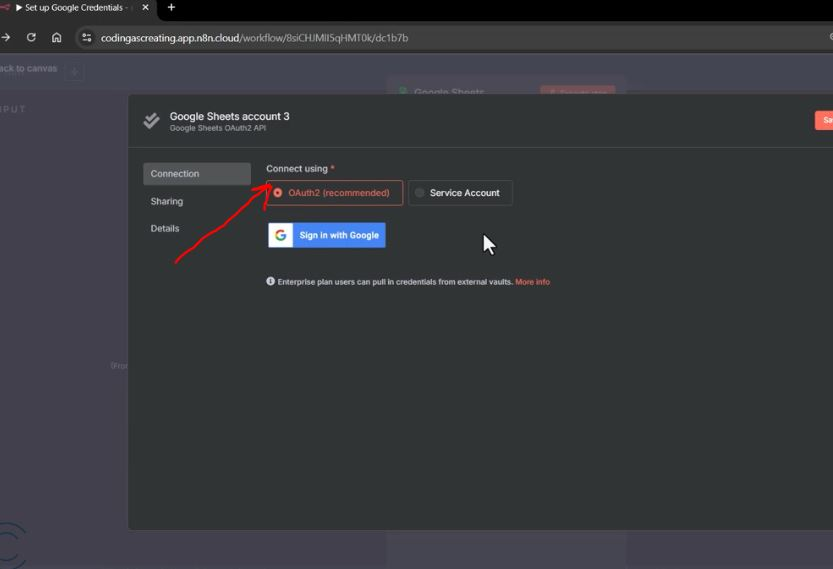

#  Zoom And [Fireflies](http://fireflies.ai/) Transcript Summarization & Email Workflow

## Workflow Overview

- **Captures Zoom meetings** via fireflies  
- **Fetches meeting participants** from Zoom  
- **Summarizes the transcript** using GPT-4o  
- **Sends the summary** to all participants via Gmail  

---

## Steps of Usage 

### 1. Schedule a Zoom Meeting
Start an instant meeting or schedule one in Zoom.  
We need the **Meeting Link** and the **Meeting ID**.  

  
*Zoom meeting link and ID.*

---

### 2. Capture the Meeting with fireflies
Give fireflies access to enter the meeting using the **Meeting Link**.  

  
  
*fireflies automatically joins the meeting to record the transcript.*

---

### 3. Workflow Trigger in n8n
After the meeting finishes, the transcript is sent to **n8n**, triggering the workflow.  

  
*Screenshot showing the n8n trigger node receiving the transcript.*

---

### 4. Receive the Summary in Gmail
The summarized transcript is automatically sent to all participants via Gmail.  

  
*Example of the summary email received by participants.* 

---

## Needed Credintionals
 
### 1. fireflies
**How to get it:**
1. Log in to your fireflies.ai dashboard.  
2. Navigate to `Settings → Developer Settings`.  
3. Add the N8N Webhook credentials.

---

### 2. Zoom

**Required Info:**
**Needed For getting the Participants in Zoom meeting so that i can send them an email**
 
- Zoom account login  
- Server-to-Server OAuth app credentials:  
  - Account ID  
  - Client ID  
  - Client Secret  
  - Access Token (generated via OAuth)

**we can got the participants from the endpoint: but it is only for paid ZOOM accounts**

**How to get keys :**
1. Go to [Zoom App Marketplace](https://marketplace.zoom.us/)  
2. Click `Develop → Build App → Server-to-Server OAuth`.  
3. Fill in required info and activate the app.  
4. Copy the **Account ID**, **Client ID**, and **Client Secret**.  
5. Use these to generate an Access Token via the Zoom OAuth endpoint:

`POST https://zoom.us/oauth/token`
grant_type=client_credentials  
account_id: your one 
We will got the response with access token  
 
this access token will be used here: 
 
`GET https://api.zoom.us/v2/past_meetings/{meetingUUID}/participants`

`Note: For my free trail account i put testing data for participants manually in N8N workflow` 
---
### 3.  OpenAI GPT-4o Credentials

**How to get:**  
I received my GPT-4o API key from ITI  

---

### 4. Gmail Credentials

**How to get:**  
1. How to get:
2. Go to Google Cloud Console  
3. Create an OAuth 2.0 Client 
4. Choose Desktop App 
5. Copy the Client ID and Client Secret 
6. Login to your Gmail account to authorize sending emails. 
`OR more easier way From N8N Gmail node ` 

 
then, Login to your Gmail account to authorize sending emails.

---

## Workflow Nodes
Here are the names of all the nodes in your workflow:

### 1. When Transcripting From Fireflies 
- Webhook node that receives data from fireflies

### 2. Format The JSON Data
- Code node that formats the speech array into a readable transcript

### 3. Model For Summarizing (GPT-4o) 
- HTTP Request node that calls OpenAI API to summarize

### 4. Node For Emails (Instead of Paid Account) 
- Set node with hardcoded participant emails

### 5. Loop Over Emails  
- Split in Batches node to process participants one by one
`Batch Size = 10`

### 6. Flatten Object JSON 
- Code node that combines summary with each participant

### 7. Send a Message of Summary For All Participants  
- Gmail node that sends emails

### 8. Get All Participants Of The Meeting 
- HTTP Request node for Zoom API (not connected in my flow)

---
### N8N Demo
---
[Watch the full N8N workflow video on Google Drive](https://drive.google.com/drive/folders/1Z4Y-8nwu3kmxxiyzNmqDnHqTWnn1HbI-?usp=sharing)
---

### Resources 

[I Highly recommend This Playlist ](https://youtu.be/FBID4TaQ6OE?si=EOUknRr_SNOm1gtN)
---

